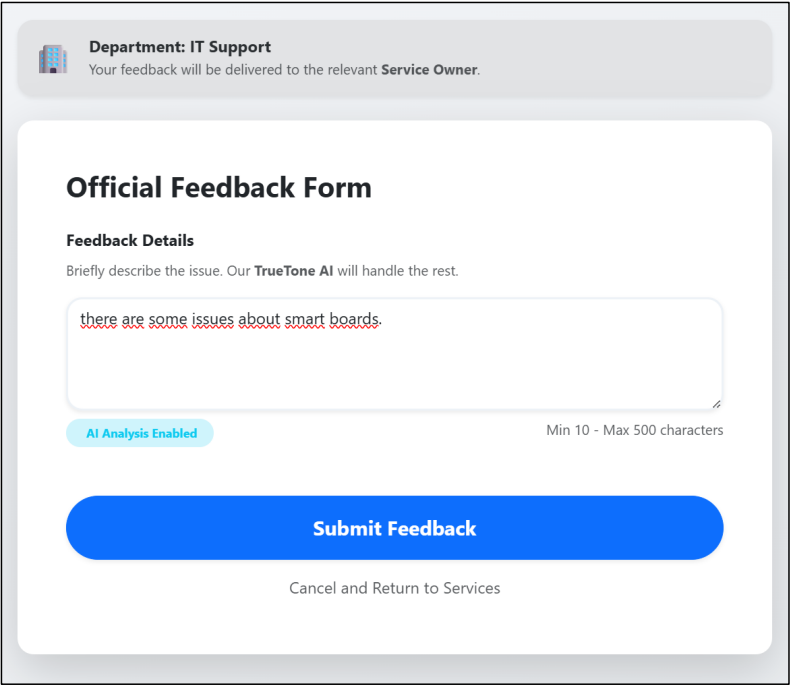
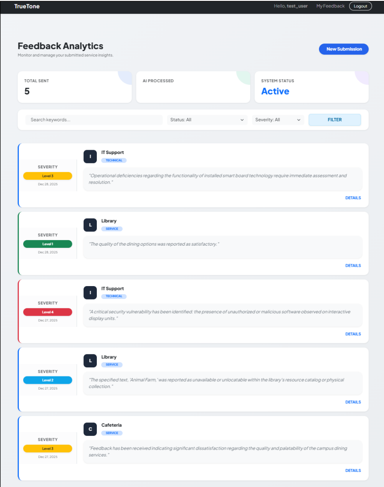
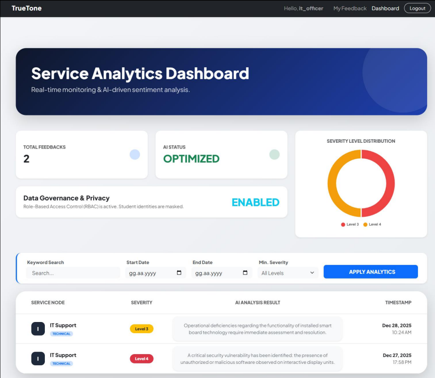
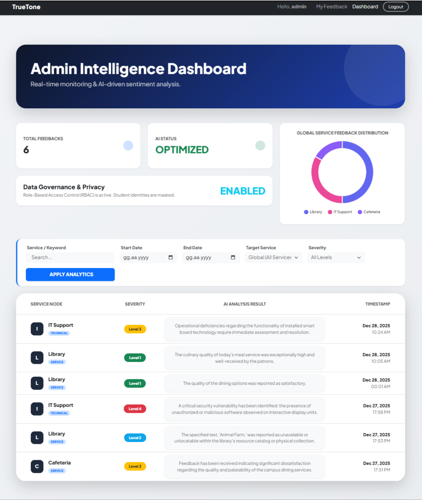

# 🎵 TrueTone: Structured Feedback & Analytics System

<p align="center">
  
  
  
</p>

**TrueTone** is a comprehensive web application designed to bridge the gap between user experiences and data-driven decision-making. It provides a structured platform for users to submit feedback while offering administrators a powerful dashboard to track and analyze trends in real-time.

---

## 🖼️ Project Preview

| User Interface | Analytics Dashboard |
| :---: | :---: |
|   |   |
| *Structured feedback forms for seamless data entry.* | *Visualized feedback metrics and user statistics.* |

---

## 🌟 Key Features

* **Structured Data Collection:** Dynamic forms that ensure feedback is categorized and actionable from the moment it's submitted.
* **Dynamic Analytics Dashboard:** A visual management suite (designed by **Aleyna**) to monitor feedback flow and user engagement metrics.
* **Secure Authentication:** Robust user management system including registration, login, and role-based access control.
* **MVT Architecture:** Built with a modular approach, separating core logic into specialized apps for user management and dashboard services.
* **Fully Responsive:** A mobile-first design approach using Bootstrap 5 to ensure accessibility across all devices.

## 🛠️ Technical Stack

* **Backend:** Python 3.x, Django Web Framework
* **Frontend:** HTML5, CSS3, JavaScript, Bootstrap 5
* **Database:** SQLite (Development) / PostgreSQL (Production ready)
* **Version Control:** Git & GitHub

## 🚀 Getting Started

To get a local copy up and running, follow these steps:

### Prerequisites
* Python 3.x installed
* Virtual Environment (recommended)

### Installation
1.  **Clone the repository:**
    ```bash
    git clone [https://github.com/cansu-oznur-avci1/truetone.git](https://github.com/cansu-oznur-avci1/truetone.git)
    ```
2.  **Setup Virtual Environment:**
    ```bash
    python -m venv venv
    # On Windows:
    venv\Scripts\activate
    # On macOS/Linux:
    source venv/bin/activate
    ```
3.  **Install Dependencies:**
    ```bash
    pip install -r requirements.txt
    ```
4.  **Run Migrations:**
    ```bash
    python manage.py migrate
    ```
5.  **Start the Server:**
    ```bash
    python manage.py runserver
    ```
    *Access the app at `http://127.0.0.1:8000/`*

## 👥 Contributors

* **Cansu Öznur Avcı** - Backend Architecture, Database Management, & System Logic.
* **Aleyna** - Frontend UI/UX Design & Dashboard Visualization.

---
<p align="center">Developed with ❤️ for better user experiences.</p>
